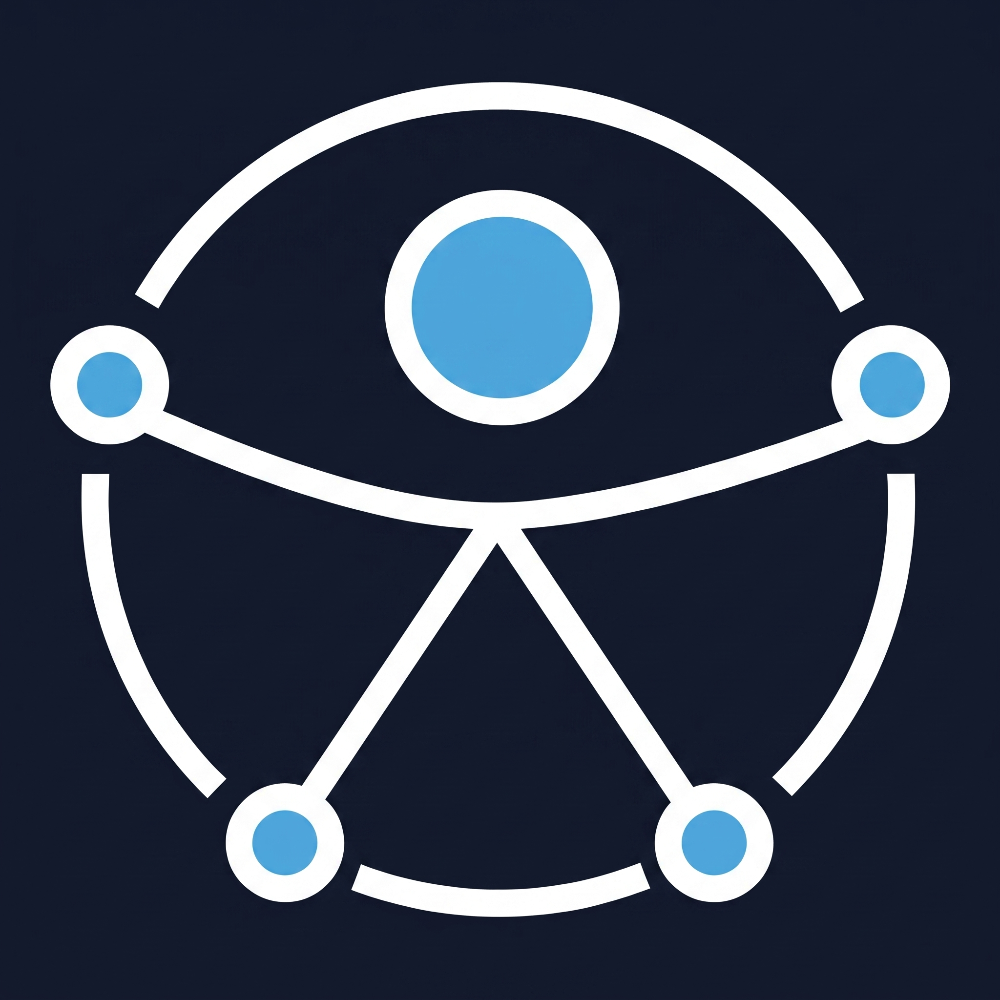
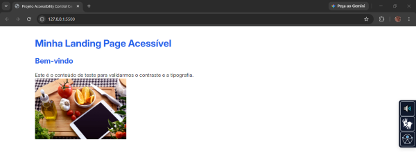
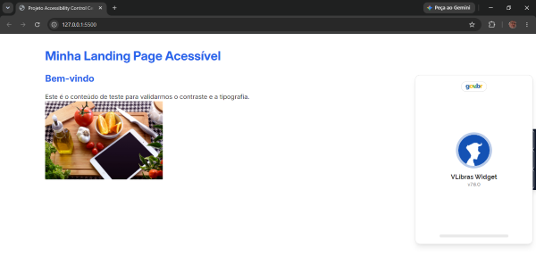
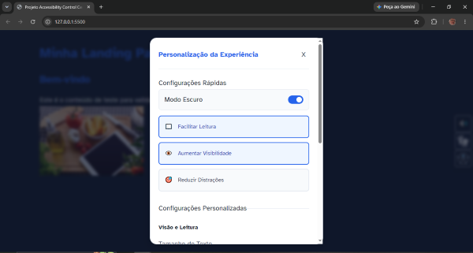
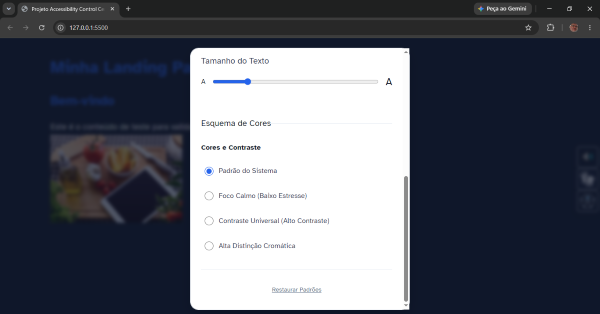
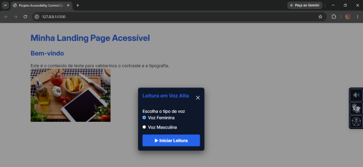
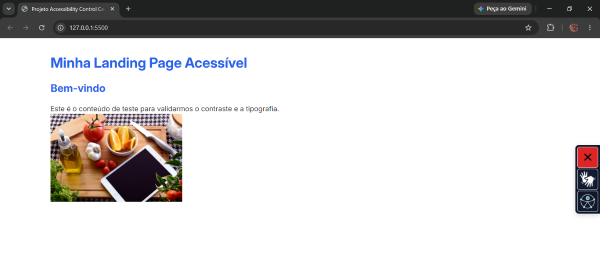

#   Projeto D.I.A. – Desenvolvimento Inclusivo e Acessível

> Laboratório prático e escalável dedicado à implementação de padrões rigorosos de Acessibilidade Digital (A11Y), focado em Design Universal, controle de estado, integrações multimodais e aderência às diretrizes WCAG.

<table align="center">
        <tbody>
                <tr>
                        <td align="center" width="50%">
                                <figure>
                                        
                                        <figcaption><strong>Versão Base (Padrão)</strong></figcaption>
                                </figure>
                        </td>
                        <td align="center" width="50%">
                                <figure>
                                        
                                        <figcaption><strong>Versão Tradução em Libras Ativa</strong></figcaption>
                                </figure>
                        </td>
                </tr>
                <tr>
                        <td align="center" width="50%">
                                <figure>
                                        
                                        <figcaption><strong>Versão com Acessibilidade Ativa</strong></figcaption>
                                </figure>
                        </td>
                        <td align="center" width="50%">
                                <figure>
                                        
                                        <figcaption><strong>Versão com Acessibilidade Ativa</strong></figcaption>
                                </figure>
                        </td>
                </tr>
                <tr>
                        <td align="center" width="50%">
                                <figure>
                                        
                                        <figcaption><strong>Versão Leitura em Voz Alta Ativa</strong></figcaption>
                                </figure>
                        </td>
                        <td align="center" width="50%">
                                <figure>
                                        
                                        <figcaption><strong>Versão Leitura em Voz Alta Desativado</strong></figcaption>
                                </figure>
                        </td>
                </tr>
        </tbody>
</table>

---

## 📖 Sobre o Projeto

O **Projeto D.I.A.** foi estruturado como uma **Central de Acessibilidade** robusta para oferecer controle total sobre a experiência de navegação. 

A proposta é demonstrar, em um ambiente Vanilla JS, como a arquitetura do código e a gestão de estado inteligente podem resolver conflitos de interface e criar um ambiente nativamente inclusivo para usuários videntes, usuários de leitores de tela e navegantes de teclado.

---

## 🎯 Problema

Na web moderna, a acessibilidade frequentemente esbarra em:

- Falta de opções de legibilidade para pessoas com dislexia ou baixa visão.
- Conflitos de contraste em implementações falhas de *Dark Mode* (Efeito Camuflagem).
- Barreiras de navegação por teclado (falta de *Skip Links* ou quebra de foco).
- Carga cognitiva excessiva devido a animações ininterruptas.
- Ausência de suporte multimodal nativo (dependência de softwares de terceiros caros ou complexos para leitura de tela).
- Perda de configurações de acessibilidade ao recarregar a página.

---

## 💡 Solução

A Central de Acessibilidade atua como um **motor de renderização inclusivo**, capaz de:

- Inverter e aplicar paletas de cores validadas (Nível AAA).
- Alternar escalas tipográficas e famílias de fontes especializadas.
- Paralisar mídias e animações para reduzir sobrecarga sensorial.
- Fornecer leitura em voz alta nativa (Text-to-Speech) com controle de gênero (Voz Feminina/Masculina) e interface de baixa fricção.
- Acionar tradução para Libras (VLibras) respeitando a identidade visual local.
- Proteger o fluxo de navegação por teclado (Focus Trap).
- Persistir as preferências do usuário na memória do navegador.

---

## 🏗️ Arquitetura Conceitual

```text
Usuário (Mouse / Teclado / Leitor de Tela)
   │
   ▼
Widget Flutuante Universal
   │
   ├── Motor de CSS Variables (Temas)
   ├── Controle Tipográfico (Escala Rem)
   ├── Filtros Sensoriais (Animações/Mídia)
   ├── Máquina de Estados (TTS Inteligente)
   ├── Integração Proxy (VLibras)
   └── Gerenciador de Conflitos de UX
   │
   ▼
[ LocalStorage API ] ──► Persistência de Estado
   │
   ▼
Interface Renderizada e Acessível
```

---

## 🧠 Pilares Técnicos

A camada de acessibilidade é dividida em módulos focados em responsabilidade única:

### 🧭 UI & Navegação
- **Widget Flutuante:** Uso da tag `<aside>` para um painel lateral persistente, utilizando o Símbolo de Acessibilidade Universal da ONU.
- **Skip Link Oculto:** Aplicação da técnica *Visually Hidden*. O link intercepta o primeiro Tab da página para pular o cabeçalho, tornando-se visível apenas quando focado.
- **Modais Semânticos:** Uso da tag nativa `<dialog>` tanto para a Central Principal quanto para o seletor de Voz, garantindo isolamento nativo (*Focus Trap*) e escurecimento do fundo via `::backdrop`.

### 🎨 Gestão de Estilos e UX (CSS)
- **Prevenção de Camuflagem:** Regras rigorosas de inversão de cor em botões primários durante a ativação do Modo Escuro.
- **Aderência à WCAG 1.4.1 (Uso da Cor):** O botão de interrupção de áudio altera simultaneamente a cor (vermelho de alerta) e a forma (ícone "X"), garantindo compreensão universal independente de daltonismo.

### 🔒 Integração e Segurança (Trade-offs)
- **Motor de Voz Híbrido (State Machine):** A interface da Web Speech API foi desenhada com estado duplo. Em repouso, aciona um mini-modal para seleção de gênero (varredura dinâmica de vozes do SO). Em atividade, o modal é suprimido e o gatilho principal converte-se em um botão de interrupção instantânea (Stop), reduzindo a carga cognitiva.
- **Integração VLibras via Padrão Proxy:** Ocultação do widget governamental original através de regras matemáticas de CSS (`opacity: 0` e deslocamento, preservando o motor WebGL) e delegação de eventos `.click()` a partir do próprio Design System.
- **Segurança (CSP Rigoroso):** Configuração cirúrgica do cabeçalho *Content-Security-Policy*, autorizando conexões específicas (jsDelivr, frame-src) necessárias para a renderização do avatar 3D, blindando a aplicação contra injeções.

---

## 🌳 Lógica de Resolução de Conflitos

O mecanismo do projeto utiliza árvores de decisão para evitar sobreposição de regras conflitantes na interface:

```text
[Input do Usuário: Slider de Fonte]
        │
        ▼
┌─────────────────────────────┐
│ 1. Verificação de Estado    │
└─────────────────────────────┘
O estado atual possui o botão de 
"Alta Visibilidade" ativado?

        │
        ├──► Não:
        │    Atualiza a variável CSS da fonte.
        │
        └──► Sim:
             Desativa o botão "Alta Visibilidade" 
             visualmente e no LocalStorage.

        │
        ▼
┌─────────────────────────────┐
│ 2. Sincronização Geral      │
└─────────────────────────────┘
Salva o novo estado e despacha a atualização para o DOM.
```
Essa abordagem garante que ajustes granulares assumam prioridade sobre atalhos rápidos, mantendo a consistência visual.

---

## 🧪 Cenários de Validação (Testes)

- **Cenário 1 – Navegação Inclusiva (Teclado):**
  - **Ação:** Usuário navega exclusivamente com a tecla Tab.
  - **Resultado:** O foco revela o Skip Link, passa suavemente pelos controles do Widget Flutuante e, ao abrir a Central, fica "preso" dentro do Modal até ser fechado com Esc.

- **Cenário 2 – Carga Cognitiva:**
  - **Ação:** Ativação do modo "Reduzir Distrações".
  - **Resultado:** O CSS injeta variáveis que pausam `animation-play-state`, desativam transições abruptas e aplicam filtro sépia nas imagens para estabilidade visual.

- **Cenário 3 – Interação Multimodal (Voz e Libras):**
  - **Ação:** Acionamento do Text-to-Speech e tradutor 3D.
  - **Resultado:** O usuário seleciona o gênero da voz via popover. Ao iniciar, a interface reage convertendo o gatilho em um botão de interrupção claro (X). Simultaneamente, o avatar de Libras opera perfeitamente ancorado às políticas de segurança (CSP).

---

## 📁 Estrutura do Projeto

```text
PROJETO_DIA_A11Y/

├── assets/
│   ├── images/
│   │   ├── a11y_isa_invertido.webp
│   │   ├── creativflyers.jpg
│   │   └── libras-50.png
│   └── to_readme/
│       ├── inicial.PNG
│       ├── libras.PNG
│       ├── person_1.PNG
│       ├── person_2.PNG
│       ├── voz_1.PNG
│       └── voz_2.PNG
│
├── scripts/
│   ├── accessibility-state.js
│   ├── accessibility-ui.js
│   └── index.js
│
├── styles/
│   ├── accessibility.css
│   ├── global.css
│   ├── index.css
│   ├── reset.css
│   └── variables.css
│
├── .gitignore
├── definitions.md
├── index.html
└── README.md
```

---

## ♿ Acessibilidade e Inclusão

Este projeto não apenas apresenta configurações, mas é construído sob boas práticas rígidas:

- HTML 100% semântico e estruturado.
- Forte aplicação de atributos WAI-ARIA (`aria-expanded`, `aria-pressed`, `aria-haspopup`, `role="switch"`).
- Contraste validado em níveis WCAG AA e AAA.
- Preparação de affordance visual (espaçamento de clique, contornos de foco espessos).
- Atendimento às diretrizes de Uso da Cor (WCAG 1.4.1).

---

## 🚀 Próximas Evoluções

- Refatoração da lógica de Vanilla JS para componentização no ecossistema React.
- Criação de testes automatizados com Cypress e axe-core.

---

## 📄 Licença

Projeto desenvolvido como laboratório contínuo de Acessibilidade Digital e boas práticas de Front-End.

---

## 👨‍💻 Autor

**Ricardo Werner**  
Desenvolvedor Front-End, unindo acessibilidade, inclusão digital e UX a 30+ anos de vivência em gestão de negócios e operações corporativas.